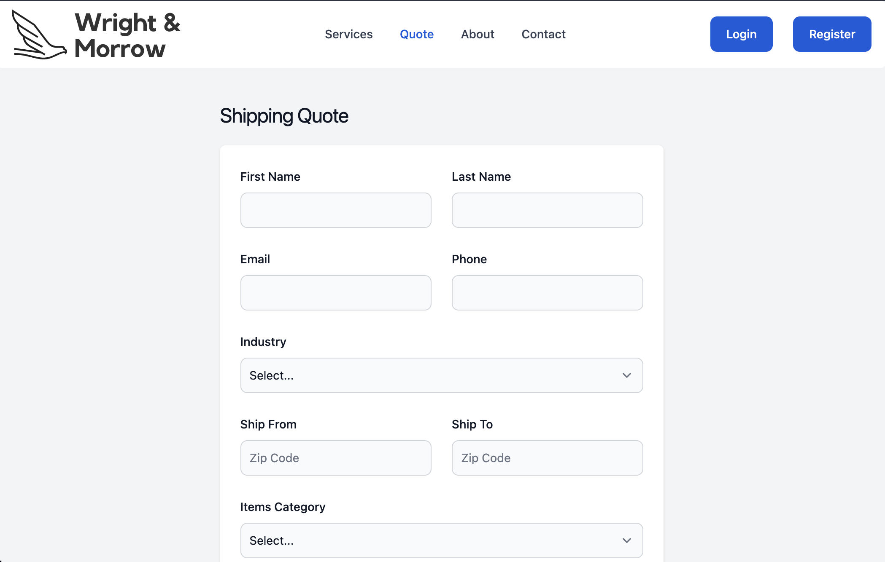

# Wright & Morrow

## Table of Contents

- [Description](#Description)

- [Installation](#Installation)

- [Instructions](#Instructions)

- [Contribute](#Contribute)

- [Questions](#Questions)

- [License](#License)

## Description

Wright & Morrow is a fictional global transport company with an employee admin app for managing customer requests (jobs), job items, customers, and employees. The app will make it easy for employees to help customers from initial request to job completed.

## Installation

Clone the repo and run `npm install` to install dependencies. Run `npm run develop` to start the server. Navigate to `localhost:3000` in your browser to view the app.

## User Profiles

As a user visiting the public-facing website, I'm presented with a form to submit a request for a shipping quote.

As an employee, I'm presented with register & login screens. Once logged in, employees can view & add jobs, job items, customers, and employees.

Users and employees are expected to communicate with each other via email while the employee updates job data to complete the job for the customer.

## Contributions

Angela : https://github.com/angeladeveloper
Backend wiz making the tables, connecting the to the Frontend, testing and bring the project to life.

Patrick : https://github.com/pdubya1632
Seed DB designer using FAKER API, Frontend designmaster making the employer and employee experience awesome, Project and GitHub manager ( kept us on track😏) .

Justin : https://github.com/Justin-Morrow
Frontend design and building out client forms + class presentation text and readme text.

## Questions

If you have questions, please contact us at the information below:

Deployed App: [Wright-Morrow](https://wright-and-morrow.herokuapp.com/)

GitHub: [Wright-Morrow](https://github.com/pdubya1632/Wright-Morrow)

## License

This application is covered under the GNU GPLv3.0 License.
