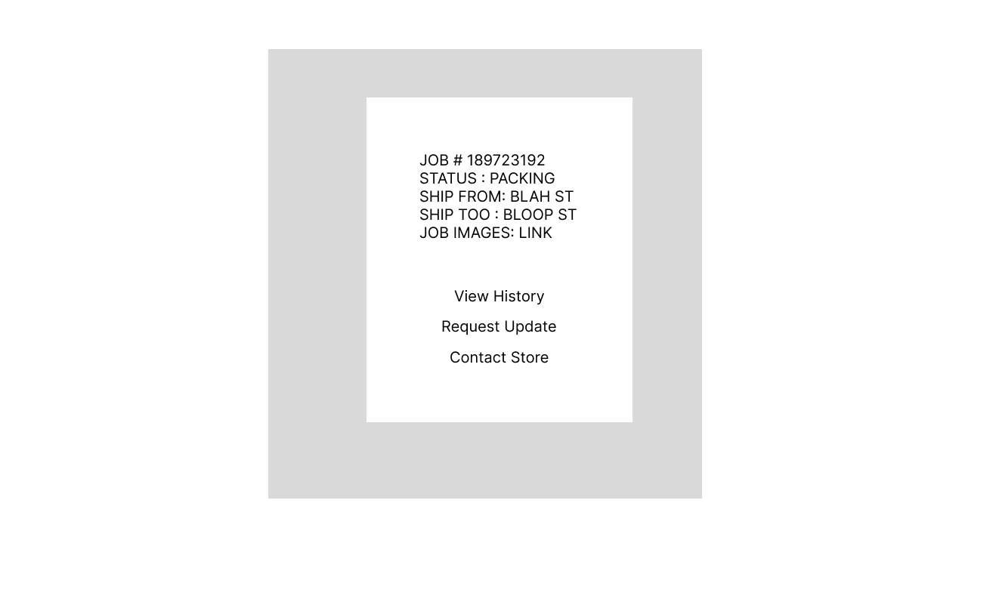

## Project Manage backend App.

I work for a company called navis pack and ship, which is a logistical packing and shipping company. We manage a ton of data.

Customers, Items, adress, contact info, vendors, shipping info, and more.

My boss is always tellnig me he wishes he had a better program to manage this.

THe way the buisbness works is someone calls up or emails and I get some basic information.

{
name:
number:
inventory:{

    },
    addresses:{
      origin,
      destination,
      shipping
    }
    pack type:
    materials used:
    hours worked:
    insurance:
    miles driven:

}

What if we made a management app for this.

We have users submit requests online all the time, but the system is awful

we really need to know a deceant amount of information to give accurate shipping quotes.

an applicatiosn where customers could submit a form for custom packing/shipping - dumbed down for this course, I think it could solve a real need in alot of similar buisneses.

## 📑 Outline.

    💁USER - Visits website/application and LOGS IN
    💁USER - Is presented with the necessary FORM INPUTS needed to provide an accurate quote. (Images would be really nice. )
    💁USER - SUBMITS form to DB and 👷‍♀️EMPLOYEE/  💁USER  can VIEW.
    👷‍♀️EMPLOYEE  READS/UPDATES information from job to start quote.
    👷‍♀️EMPLOYEE can COMMENT or RESPOND to users form for more information or clarification.
      - EX> 💁USER : Could I get an estimate for shipping my Flux Capacitor?
      -     👷‍♀️EMPLOYEE : Absolutely! I will jsut need a bit more information to get started. What is...
    👷‍♀️EMPLOYEE & 💁USER Discuss need for project and come to mutual descion.
    💁USER Track the job until piece arrives.
    👷‍♀️EMPLOYEE Completes job and submits info for tracking and records
    👷‍♀️EMPLOYEE & 💁USER can always view information for refrence in future.

## 💽 DB

Store:

- Jobs
- Customers

## ⚒️ Functionality

- Secure login
- User can view their job in progress
- Employee can ask for feedback and info in real time
- DB connectivity

## 🎁 Additional Functionality

- Pricing capabilties
- Scheduling Capabities
  - Calendar, dynamic scheduler
- Employee Distiction - Too add schema to DB
- PWA for Admins?
- Storage options for Photos
- Automatic emails
